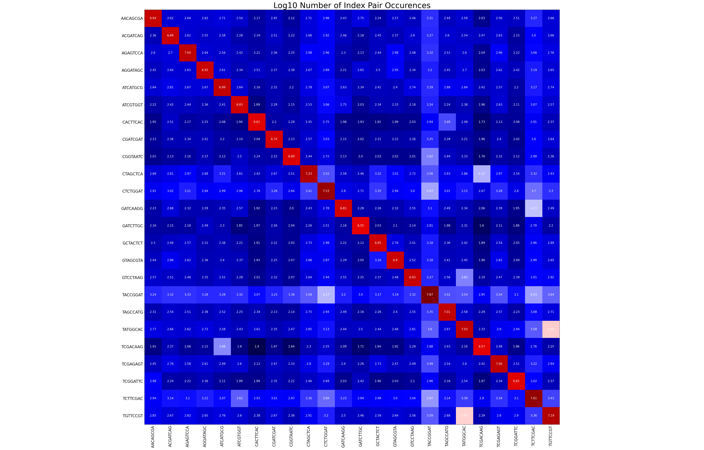
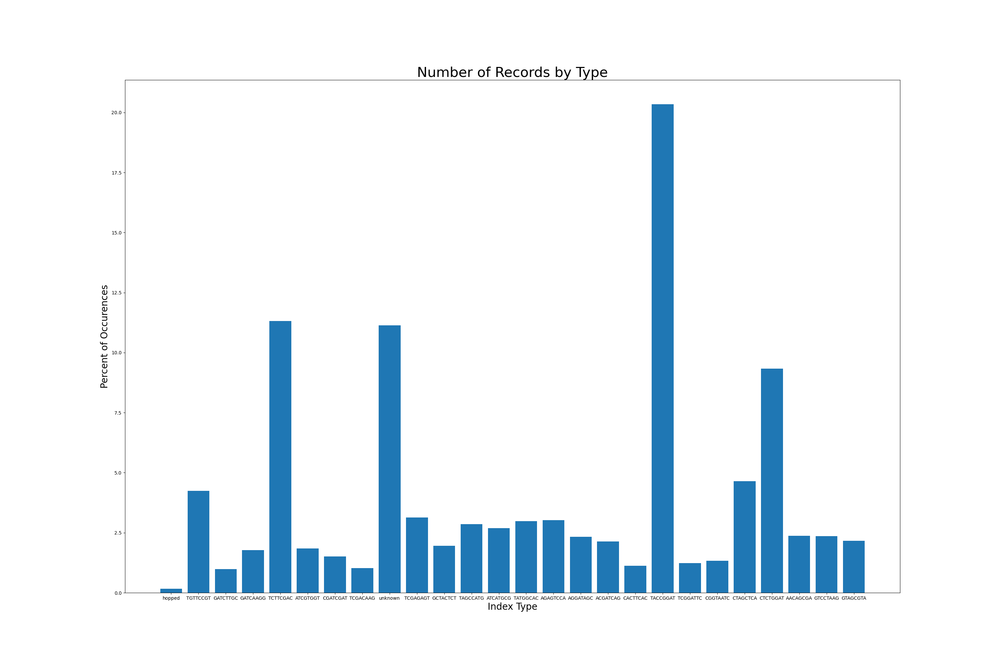

Percentage of Reads by Type:

```
File Type:  Percentage of Reads:
hopped: 0.16%
TGTTCCGT: 4.24%
GATCTTGC: 0.98%
GATCAAGG: 1.77%
TCTTCGAC: 11.31%
ATCGTGGT: 1.85%
CGATCGAT: 1.51%
TCGACAAG: 1.03%
unknown: 11.14%
TCGAGAGT: 3.13%
GCTACTCT: 1.96%
TAGCCATG: 2.85%
ATCATGCG: 2.69%
TATGGCAC: 2.98%
AGAGTCCA: 3.02%
AGGATAGC: 2.33%
ACGATCAG: 2.14%
CACTTCAC: 1.12%
TACCGGAT: 20.34%
TCGGATTC: 1.23%
CGGTAATC: 1.33%
CTAGCTCA: 4.65%
CTCTGGAT: 9.34%
AACAGCGA: 2.37%
GTCCTAAG: 2.36%
GTAGCGTA: 2.17%
```

Log10 of Overall Index Pairs:



Number of records by file:
